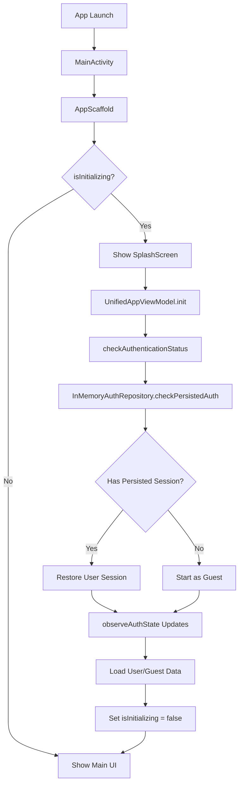

# App Startup Authentication Flow

## Overview

The app now implements a proper authentication check during startup that determines whether to start in Guest or LoggedIn mode BEFORE any Firebase Realtime Database connections are made. This ensures proper security rules can be applied based on authentication state.

## Architecture

### Startup Flow Sequence



## Key Components

### 1. InMemoryAuthRepository

**File:** `/shared/src/commonMain/kotlin/com/together/newverse/data/repository/InMemoryAuthRepository.kt`

#### Persistent Session Simulation

```kotlin
// Simulated persistent storage (like SharedPreferences/UserDefaults)
private var persistedUserId: String? = null

suspend fun checkPersistedAuth(): Result<String?> {
    // Simulate network/storage delay
    delay(500)

    // Check if we have a persisted user ID (simulating token validation)
    persistedUserId?.let { userId ->
        // Validate the persisted session is still valid
        if (users.values.any { it.userId == userId }) {
            _currentUserId.value = userId
            Result.success(userId)
        } else {
            // Session invalid, clear it
            persistedUserId = null
            _currentUserId.value = null
            Result.success(null)
        }
    } ?: Result.success(null)
}
```

#### Session Persistence

- **On Sign In/Up:** Stores `persistedUserId`
- **On Sign Out:** Clears `persistedUserId`
- **On App Start:** Checks and validates `persistedUserId`

### 2. UnifiedAppViewModel Initialization

**File:** `/shared/src/commonMain/kotlin/com/together/newverse/ui/state/UnifiedAppViewModel.kt`

#### Initialization Sequence

```kotlin
private fun initializeApp() {
    viewModelScope.launch {
        // Step 1: Set initializing state
        _state.update { current ->
            current.copy(
                meta = current.meta.copy(
                    isInitializing = true,
                    initializationStep = "Checking authentication..."
                )
            )
        }

        // Step 2: Check authentication status FIRST
        checkAuthenticationStatus()

        // Step 3: Wait for auth state propagation
        delay(100)

        // Step 4: Load data based on auth status
        val isAuthenticated = _state.value.common.user is UserState.LoggedIn

        if (isAuthenticated) {
            // Load user-specific data
            loadUserProfile()
            loadProducts()
        } else {
            // Load public data only
            loadProducts()
        }

        // Step 5: Mark initialization complete
        _state.update { current ->
            current.copy(
                meta = current.meta.copy(
                    isInitializing = false,
                    isInitialized = true
                )
            )
        }
    }
}
```

### 3. SplashScreen Component

**File:** `/shared/src/commonMain/kotlin/com/together/newverse/ui/screens/SplashScreen.kt`

Shows during initialization with:
- App logo/icon
- Loading animation
- Status text (e.g., "Checking authentication...", "Loading user data...")
- Animated dots for visual feedback

### 4. AppScaffold Integration

**File:** `/shared/src/commonMain/kotlin/com/together/newverse/ui/navigation/AppScaffold.kt`

```kotlin
@Composable
fun AppScaffold() {
    val viewModel = koinViewModel<UnifiedAppViewModel>()
    val appState by viewModel.state.collectAsState()

    // Check if app is still initializing
    if (appState.meta.isInitializing) {
        // Show splash screen during initialization
        SplashScreen(
            initializationStep = appState.meta.initializationStep
        )
        return // Exit early, don't show main UI yet
    }

    // Show main UI only after initialization
    // ...
}
```

## App State During Startup

### AppMetaState Fields

```kotlin
data class AppMetaState(
    val isInitializing: Boolean = false,  // True during startup
    val isInitialized: Boolean = false,   // True after first init
    val initializationStep: String = ""   // Current step description
)
```

### Initialization Steps

1. **"Checking authentication..."** - Validating persisted session
2. **"Loading user data..."** - Loading user profile (if authenticated)
3. **"Loading products..."** - Loading product catalog
4. **Empty string** - Initialization complete

## Testing Scenarios

### Scenario 1: Auto-Login (Persisted Session)

1. User previously signed in
2. App restarts
3. Splash shows "Checking authentication..."
4. Session validated, user restored
5. App loads with user logged in
6. Firebase connects with auth credentials

### Scenario 2: Guest Mode (No Session)

1. No previous session or user signed out
2. App starts
3. Splash shows "Checking authentication..."
4. No session found
5. App loads in guest mode
6. Firebase connects with limited access

### Scenario 3: Invalid Session

1. Persisted session exists but invalid
2. App starts
3. Session validation fails
4. Session cleared
5. App loads in guest mode

## Configuration

### Enable/Disable Auto-Login for Testing

In `InMemoryAuthRepository.kt`:

```kotlin
init {
    // To test auto-login:
    persistedUserId = "buyer_001"  // TEST: Auto-login as buyer

    // To test guest flow:
    // persistedUserId = null
}
```

### Adjust Initialization Delay

In `InMemoryAuthRepository.checkPersistedAuth()`:

```kotlin
// Simulate network/storage delay
delay(500)  // Adjust this value for testing
```

## Firebase Integration Points

### When to Connect to Firebase

1. **AFTER** authentication check completes
2. **AFTER** user state is determined (Guest or LoggedIn)
3. **BEFORE** loading user-specific data

### Security Rules Application

```javascript
// Firebase Realtime Database Rules
{
  "rules": {
    "users": {
      "$uid": {
        ".read": "$uid === auth.uid",  // Requires authentication
        ".write": "$uid === auth.uid"
      }
    },
    "products": {
      ".read": true,  // Public access
      ".write": "auth !== null"  // Requires authentication
    }
  }
}
```

## Production Considerations

### Replace InMemoryAuthRepository

For production, implement proper authentication:

1. **Firebase Auth**
   ```kotlin
   class FirebaseAuthRepository : AuthRepository {
       override suspend fun checkPersistedAuth(): Result<String?> {
           return FirebaseAuth.getInstance().currentUser?.let { user ->
               Result.success(user.uid)
           } ?: Result.success(null)
       }
   }
   ```

2. **Custom Backend**
   ```kotlin
   class ApiAuthRepository : AuthRepository {
       override suspend fun checkPersistedAuth(): Result<String?> {
           // Check stored JWT token
           val token = secureStorage.getToken()
           return if (token != null && validateToken(token)) {
               Result.success(getUserIdFromToken(token))
           } else {
               Result.success(null)
           }
       }
   }
   ```

### Secure Storage

Replace in-memory persistence with:
- **Android:** EncryptedSharedPreferences
- **iOS:** Keychain
- **Web:** Secure cookies or localStorage with encryption

### Error Handling

Add comprehensive error handling:

```kotlin
private suspend fun checkAuthenticationStatus() {
    try {
        authRepository.checkPersistedAuth()
            .onSuccess { /* ... */ }
            .onFailure { error ->
                // Log error
                analytics.logError("auth_check_failed", error)
                // Show user-friendly message
                showError("Unable to verify login status")
                // Default to guest mode
                startAsGuest()
            }
    } catch (e: Exception) {
        // Handle unexpected errors
        handleCriticalError(e)
    }
}
```

## Benefits

1. **Secure Firebase Connection**: Auth state determined before DB connection
2. **Better UX**: Seamless auto-login for returning users
3. **Clean Architecture**: Separation of concerns
4. **Testable**: Easy to test different scenarios
5. **Scalable**: Easy to replace with production auth

## Troubleshooting

### Issue: Splash screen shows too briefly

**Solution:** Increase delay in `checkPersistedAuth()` or add minimum display time:

```kotlin
val startTime = System.currentTimeMillis()
checkAuthenticationStatus()
val elapsed = System.currentTimeMillis() - startTime
if (elapsed < MIN_SPLASH_TIME) {
    delay(MIN_SPLASH_TIME - elapsed)
}
```

### Issue: User state not updating

**Solution:** Ensure `observeAuthState()` is collecting in ViewModel init:

```kotlin
init {
    observeAuthState()  // Must be called
    initializeApp()
}
```

### Issue: Firebase connects too early

**Solution:** Ensure Firebase initialization is called AFTER auth check:

```kotlin
if (isAuthenticated) {
    initializeFirebaseWithAuth(userId)
} else {
    initializeFirebaseAsGuest()
}
```

## Summary

The app now properly handles authentication on startup:

✅ Checks for persisted session before Firebase connection
✅ Shows splash screen during initialization
✅ Determines Guest vs LoggedIn state early
✅ Loads appropriate data based on auth state
✅ Provides smooth user experience
✅ Ready for production authentication integration